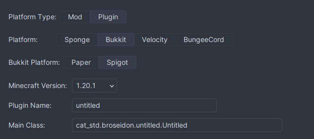

# MC TUTORIAL 01

## Các bước tạo một Project Minecraft Plugin

> [!WARNING]  
> Đây là bài viết dành cho người mới bắt đầu với Minecraft Plugin, nếu bạn đã có kinh nghiệm với Minecraft Plugin thì có thể bỏ qua bài viết này.

### 1. Chuẩn bị

Để bắt đầu với Minecraft Plugin, bạn cần có một số thứ sau:

- Một IDE (Integrated Development Environment) để code, trong bài viết này mình sẽ sử dụng [IntelliJ IDEA](https://www.jetbrains.com/idea/).

> [!NOTE]  
> Nếu bạn sử dụng IntelliJ IDEA thì có thể cài đặt [Minecraft Development Plugin](https://plugins.jetbrains.com/plugin/8327-minecraft-development). <br> 
> Đây là một Plugin Framework cho Minecraft, nó sẽ giúp bạn tạo một Project Minecraft Plugin một cách nhanh chóng và dễ dàng hơn.

- Một server Minecraft để test Plugin của bạn, trong bài viết này mình sẽ sử dụng [PaperMC](https://papermc.io/).
- Một số kiến thức cơ bản về Java, nếu bạn chưa có kiến thức về Java thì có thể tham khảo tại [đây](https://www.w3schools.com/java/).
- Một số kiến thức cơ bản về Minecraft Plugin, nếu bạn là người mới thì có thể tham khảo tại [đây](https://www.spigotmc.org/wiki/spigot-plugin-development/).

### 2. Tạo Project

> [!NOTE]  
> Để tạo một Project Minecraft Plugin, bạn có thể sử dụng [Maven](https://maven.apache.org/) hoặc [Gradle](https://gradle.org/). Trong bài viết này mình sẽ sử dụng Maven.

- Bước 1: Mở IntelliJ IDEA lên và chọn `Create New Project`. Bạn sẽ thấy mục `Minecraft Development`.
    
- Bước 2: Chọn tên cho Project và nơi lưu Project. <br>
    
- Bước 3: Chọn `Plugin` và `Paper` (hoặc `Spigot`).
- Bước 4: Tiếp tục chọn Phiên bản Minecraft, tên Plugin và Class Chính.
    
- Bước 5: Nhấn `Create` để tạo Project.

> [!NOTE]  
> Ngoài các tùy chọn trên, bạn có thể tùy chỉnh các mục khác <br>
> Điều này sẽ không được đề cập trong bài viết này. <br>
    

### 3. Cấu trúc Project

Sau khi tạo Project, bạn sẽ thấy cấu trúc Project như sau:
```
.
├── pom.xml
└── src
    └── main
        ├── java
        │   └── com
        │       └── example
        │           └── tutorial
        │               └── Tutorial.java
        └── resources
            └── plugin.yml
```

- `pom.xml`: File cấu hình Maven.
- `src/main/java`: Thư mục chứa mã nguồn Java.
- `src/main/resources`: Thư mục chứa các tài nguyên của Plugin.
- `src/main/resources/plugin.yml`: File cấu hình Plugin.
- `src/main/java/com/example/tutorial/Tutorial.java`: Class chính của Plugin.

### 4. Plugin.yml

File `plugin.yml` là file cấu hình của Plugin, nó sẽ chứa các thông tin về Plugin như tên, phiên bản, tác giả, mô tả, các lệnh, các quyền, ... <br>
Để tạo một Plugin.yml, bạn có thể sử dụng [Minecraft Development Plugin](https://plugins.jetbrains.com/plugin/8327-minecraft-development) hoặc tạo thủ công. <br>

### 5. Class Chính

Class chính của Plugin sẽ được tạo trong thư mục `src/main/java/com/example/tutorial/Tutorial.java`. <br>
Đây là nơi bạn sẽ code Plugin của mình. <br>

Cấu trúc Class chính của Plugin sẽ như sau:
```java
package com.example.tutorial;

import org.bukkit.plugin.java.JavaPlugin;

public final class Tutorial extends JavaPlugin {

    @Override
    public void onEnable() {
        // Method này sẽ được gọi khi Plugin được bật
    }

    @Override
    public void onDisable() {
        // Method này sẽ được gọi khi Plugin được tắt
    }
}
```

### 6. Build Project

Để build Project thành file JAR, bạn có thể sử dụng Maven hoặc Gradle. <br>
Trong bài viết này mình sẽ sử dụng Maven. <br>

Để build Project, bạn có thể sử dụng các lệnh sau:
- `mvn clean`: Xóa các file đã build.
- `mvn package`: Build Project.

Sau khi build Project, bạn sẽ thấy file JAR của Plugin trong thư mục `target`. <br>

### 7. Test Plugin

Để test Plugin, bạn cần có một server Minecraft. <br>
Trong bài viết này mình sẽ sử dụng [PaperMC](https://papermc.io/). <br>

Hãy thiết lập server Minecraft của bạn và chạy server. <br>

Sau khi server đã chạy, hãy copy file JAR của Plugin vào thư mục `plugins` của server. <br>

Sau khi copy file JAR của Plugin vào thư mục `plugins`, hãy khởi động lại server. <br>

Nếu không có lỗi nào xảy ra, bạn đã thành công. <br>

## Lời Kết

Đây là bài viết đầu tiên trong series Minecraft Plugin Tutorial. <br>
Nếu bạn có bất kì thắc mắc nào, hãy liên hệ với mình qua [Discord](https://discord.com/users/873024375685775361)

> [!IMPORTANT]  
> Bài viết này được viết bởi [Lê Minh Bảo]() <br>
> Hãy cho mình một sao nếu bạn thấy bài viết này hữu ích nhé! <br>
> Xin cảm ơn!
